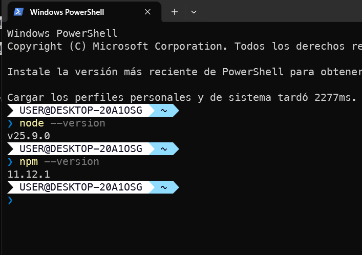
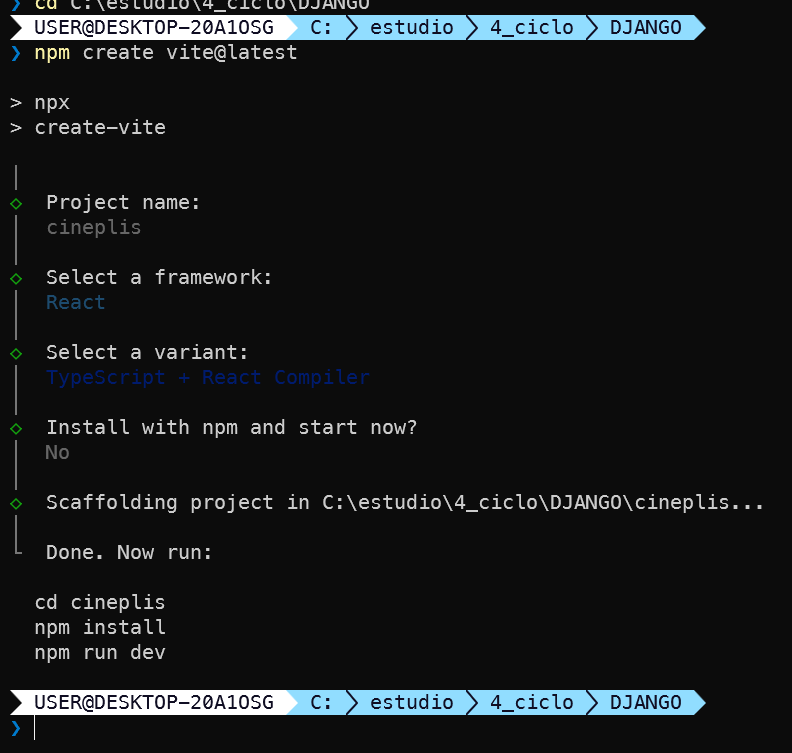
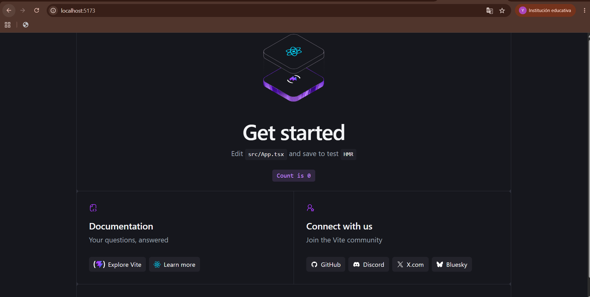
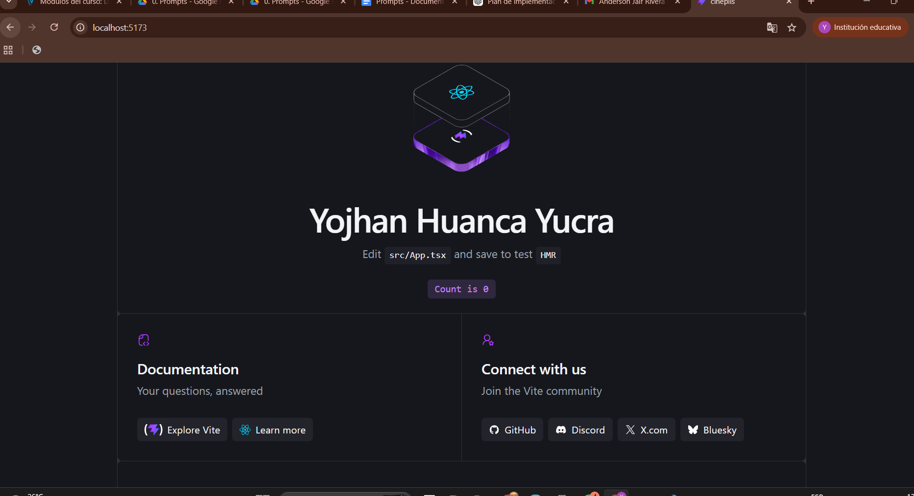
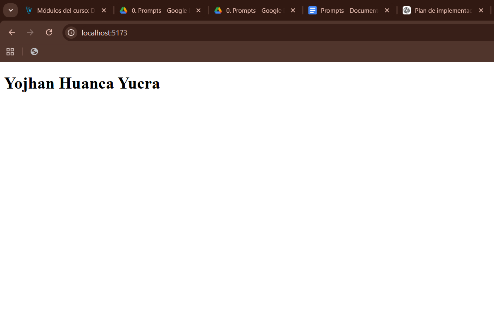
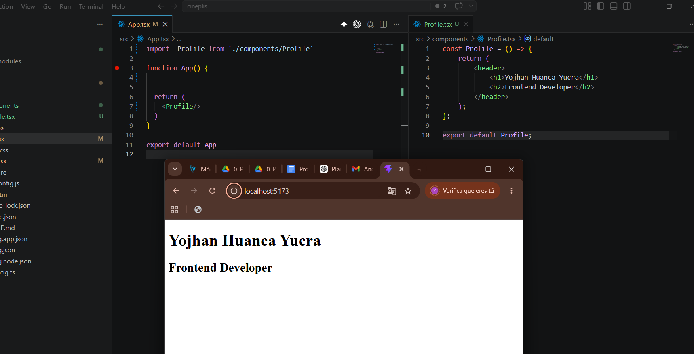

# Documentación de CinEPlis

## 1. Verificar versiones de Node.js y npm

## 2. Crear proyecto con Vite

## 3. Iniciar el servidor de desarrollo

## 4. Ejecutar comando para mostrar nombre del proyecto

## 5. Ejecutar comando para mostrar nombre del proyecto

## 6. Crear un componente React

